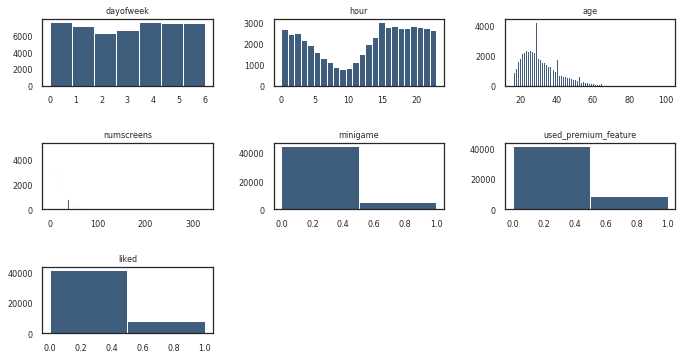
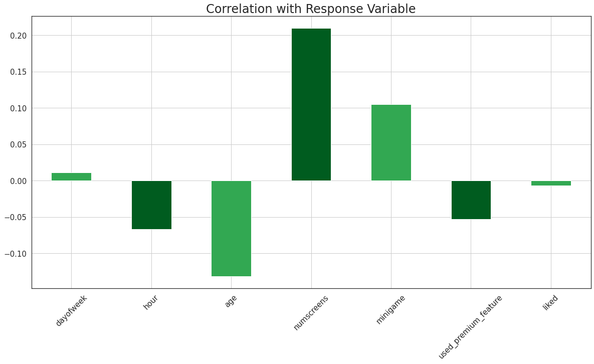
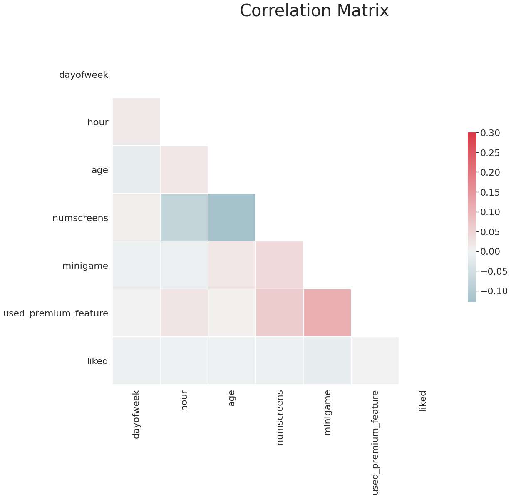
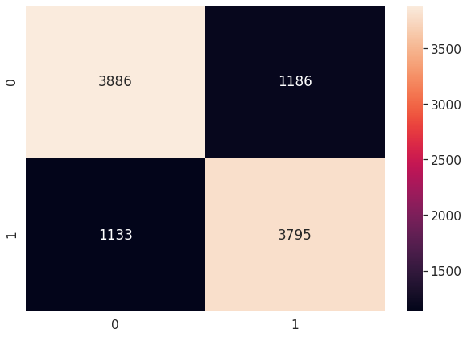

# App Behaviour Analysis
This repo consists of the App Behaviour Analysis Case Study from Super Data Science's course, Machine Learning Practical: 6 Real-World Applications.

## Problem Statement
The objective of this model is to predict which users will not subscribe to the paid membership of the Application involved, with the help of various features provided for each user, so that greater marketing efforts can go into trying to **convert** those users to Paid Users.

## Model Used
The case study utilises Logistic Regression Model from the Scikit Learn Library, which is evaluated using K-Fold Cross Validation & Grid Search, and later undergoes Feature Selection, to maintain a balance between the Accuracy and Number of Input Features.

## Libraries Used
- Pandas
- Numpy
- Matplotlib
- Seaborn
- Scikit Learn

## Visualisation of the data
*The following plot (Matplotlib Subplots) shows Histograms of 7 of the Features from the entire Dataset*
 
 

## Correlation with User Enrolled
*The following plot (Pandas Bar Plot) shows a measure of the Correlation of the above features, with the Response Variable (Enrollment of the User)*
 
 

## Correlation Among the Features
*The following plot (Seaborn Heatmap) shows the Correlation among the above 7 Features, with each other*
 
 

## Confusion Matrix
*The following plot (Seaborn Heatmap) shows the Confusion Matrix for the Test Set Results & the Predicted Results*
 
 
